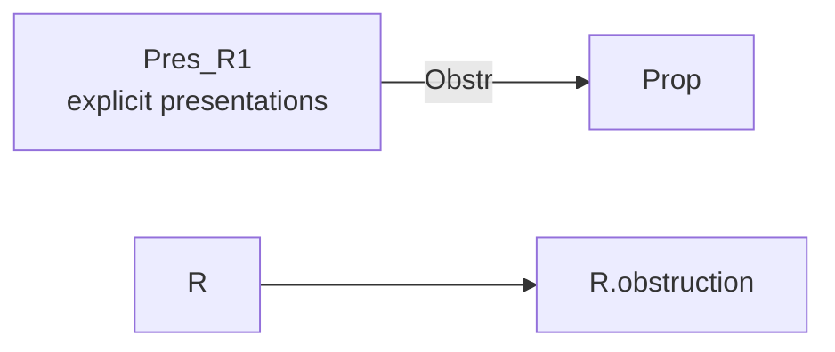
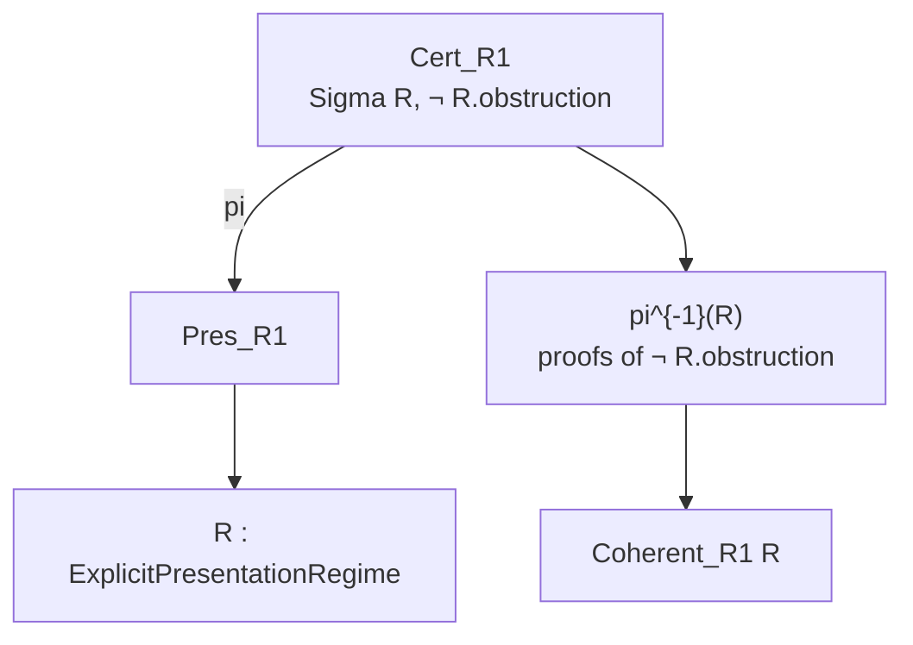
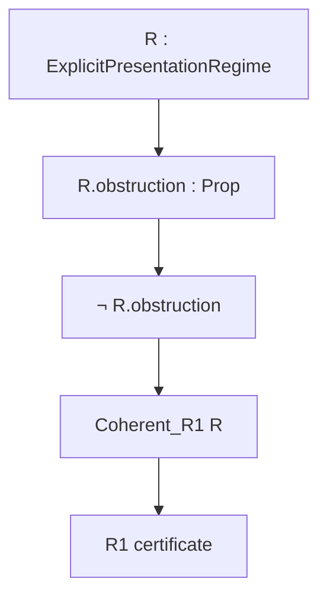
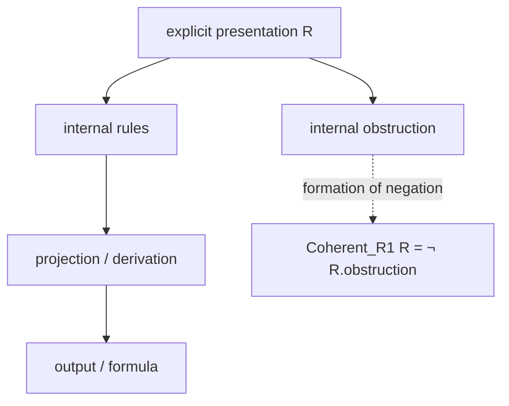
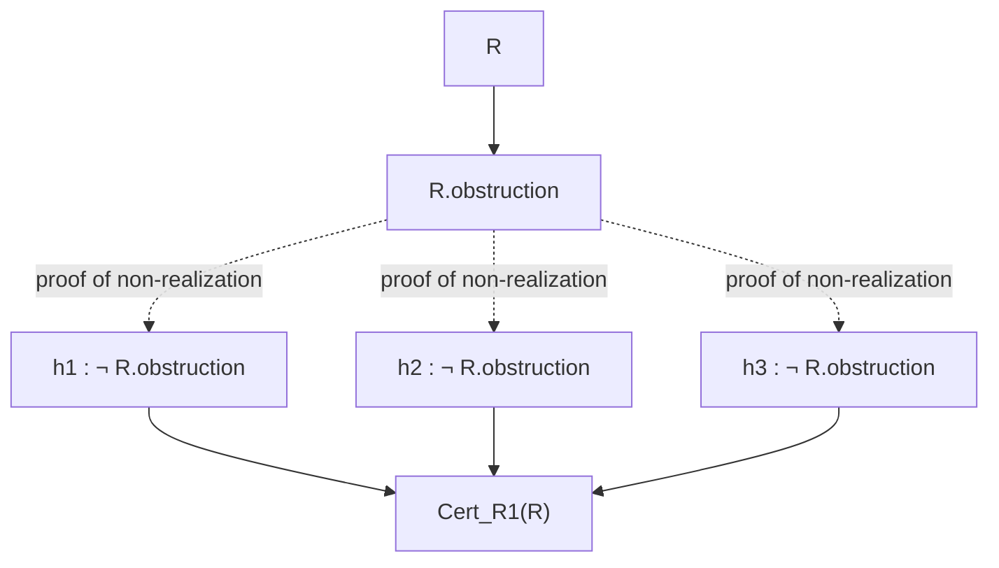
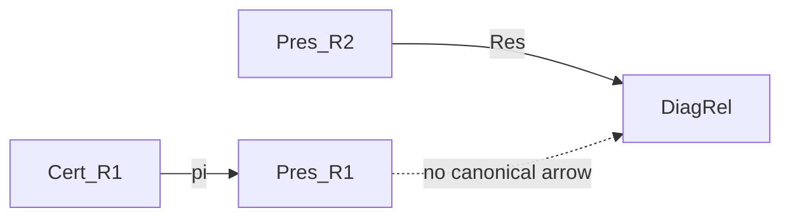
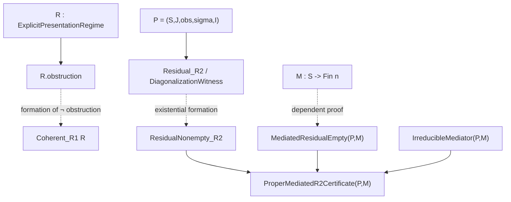

# Categorical Diagrams for R1

Status: diagrammatic note.

This file gives an informal categorical reading of the R1 regime isolated in:

```text
RegimesSelfContained.lean
Local_closure_regimes.md
```

It is not yet a categorical formalization in Lean. Its purpose is to fix the
kind of certificate carried by R1: an explicit presentation is certified
relative to a designated internal obstruction.

## 1. Minimal R1 Object

In Lean, the R1 core is:

```lean
structure ExplicitPresentationRegime where
  obstruction : Prop

def Coherent_R1 (R : ExplicitPresentationRegime) : Prop :=
  ¬ R.obstruction
```

Reading:

```text
R1 does not yet certify informational faithfulness.
R1 certifies the absence of a designated internal obstruction.
```

## 2. Category of Explicit Presentations

We write:

```text
Pres_R1
```

for the informal category of explicit presentations.

An object is:

```text
R : ExplicitPresentationRegime
```

An informal morphism:

```text
R -> R'
```

is a transformation of presentations that transports the relevant explicit
structure:

```text
language;
rules;
derivations;
projections;
outputs;
internal obstructions.
```

The Lean file does not formalize these morphisms. It formalizes only the
predicate carried by each object:

```text
R.obstruction : Prop.
```

## 3. Obstruction Projection

The field projection:

```text
obstruction : ExplicitPresentationRegime -> Prop
```

can be read meta-categorically as an informal functor:

```text
Obstr : Pres_R1 -> Prop
```

given by:

```text
Obstr(R) := R.obstruction.
```

Diagram:



In Lean, this arrow is simply the field:

```lean
R.obstruction
```

## 4. Fibration of R1 Certificates

The R1 certificate over `R` is:

```text
Coherent_R1 R := ¬ R.obstruction.
```

Thus R1 certificates can be read as a fibration:

```text
Cert_R1 -> Pres_R1
```

where the fiber above `R` is:

```text
pi^{-1}(R) = { h | h : ¬ R.obstruction }.
```

Diagram:



Reading:

```text
an R1 certificate is an object over an explicit presentation;
it proves that the internal obstruction designated by that presentation
is not realized.
```

## 5. Complete R1 Diagram



This diagram must be read as predicate dependency:

```text
R
-> R.obstruction
-> ¬ R.obstruction
-> Coherent_R1 R.
```

It does not mean that an obstruction produces its own negation. It means that
the R1 coherence predicate is built as the negation of the obstruction carried
by `R`.

## 6. Explicit Presentation and Internal Agreement

An explicit presentation may contain a projection or derivation:

```text
pi : S -> O
T |- phi
```

R1 certifies that the designated internal obstruction, intended to capture a
failure of respect for the presentation, is absent.

Diagram:



Reading:

```text
the output is compatible with the explicit rules;
the designated internal obstruction is not realized.
```

## 7. Fiber Above a Presentation

For a fixed presentation `R`, the fiber of R1 certificates is:

```text
Cert_R1(R) := { h : ¬ R.obstruction }.
```

Diagram:



Since the target is `Prop`, this diagram encodes a space of proofs, not an
additional computational data structure.

## 8. What R1 Does Not Carry by Default

The R1 diagram contains no canonical arrow:

```text
Pres_R1 -> DiagRel
```

In other words, R1 does not automatically construct:

```text
DiagonalizationWitness obs sigma I x y.
```

Separation diagram:



This absence is the separation point between R1 and R2.

R1 may syntactically contain the words or predicates needed by R2, but its
characteristic certificate does not require them.

## 9. Comparison With R2

The R2 diagram starts where R1 stops:

```text
R1:
  explicit presentation
  -> internal obstruction
  -> absence of obstruction.

R2:
  presentation of interfaces
  -> diagonal witness
  -> residual
  -> separating mediator
  -> proper irreducible certificate.
```

Comparative diagram:



Reading:

```text
R1 certifies internal coherence.
R2 certifies local closure of required distinctions.
```

## 10. Compact R1 Diagram

```text
Cert_R1 -- pi --> Pres_R1 -- Obstr --> Prop
   |
   `-- proof --> ¬ Obstr(R)
```

Expansion:

```text
Cert_R1(R)
=
{ h | h : ¬ R.obstruction }.
```

Thus:

```text
Coherent_R1 R
=
¬ R.obstruction.
```

## 11. R1 Invariant

The R1 invariant is not a minimal dimension.

It is not a residual.

It is not a diagonal witness.

It is:

```text
absence of an internal obstruction to the explicit presentation.
```

Compact formula:

```text
chi_R1(R) := Coherent_R1 R = ¬ R.obstruction.
```

The notation `chi_R1` is meta-mathematical. Lean formalizes only:

```lean
Coherent_R1 R
```

## 12. Final Reading

```text
R1:
  a certificate over an explicit presentation R,
  proving that the internal obstruction designated for R is not realized.
```

```text
R2:
  a certificate over an interface presentation P,
  proving that diagonal witnesses are absent or separated
  by finite irreducible mediation.
```

The categorical separation is therefore:

```text
R1 : Cert_R1 -> Pres_R1 -> Prop
R2 : MinCert -> PropCert -> Pres_R2 -> DiagRel
```

R1 fixes the regime of internal coherence. R2 adds the regime of local
informational faithfulness.
