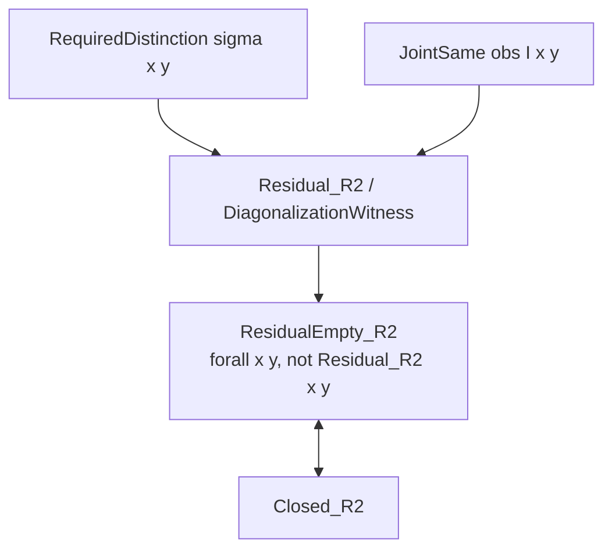
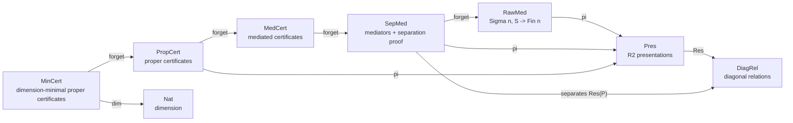
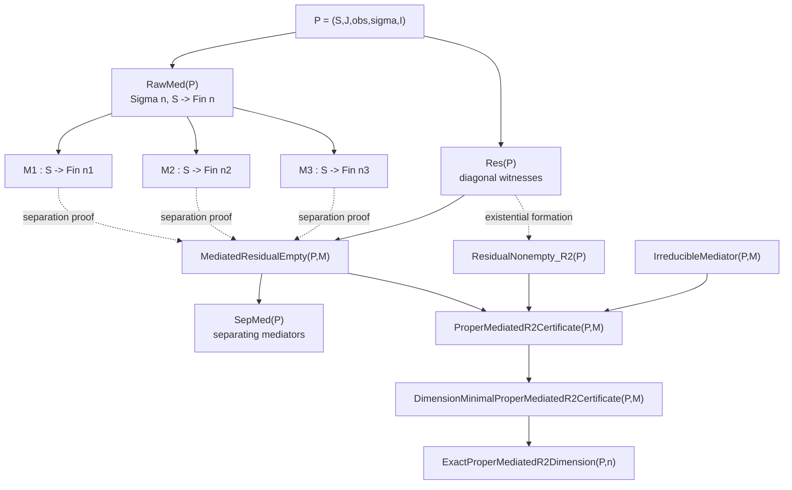
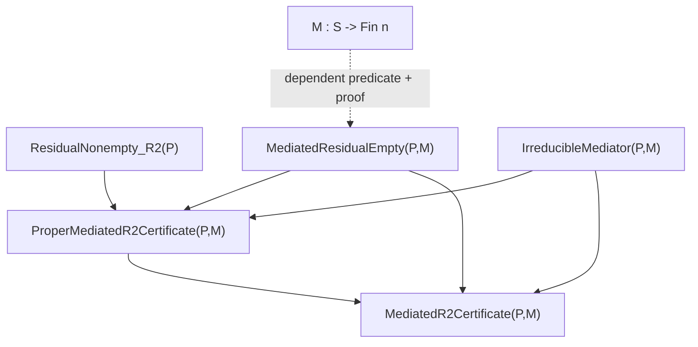
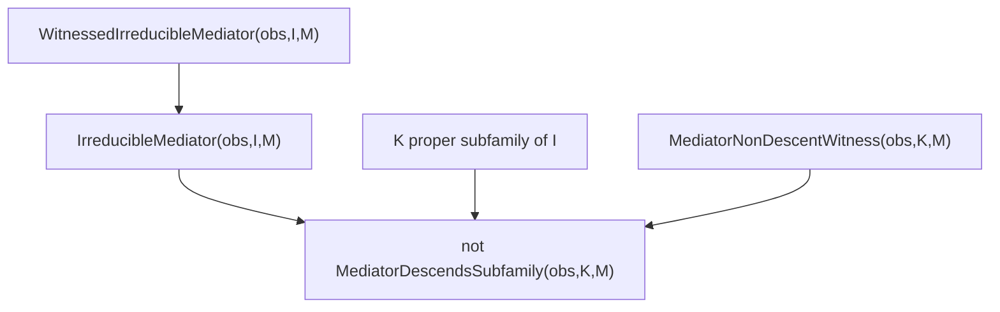
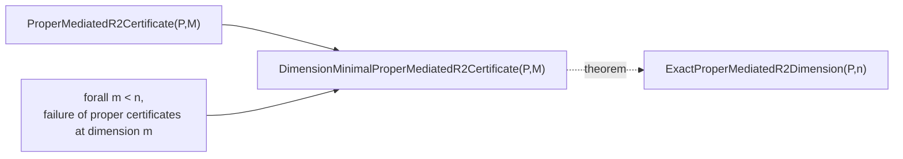
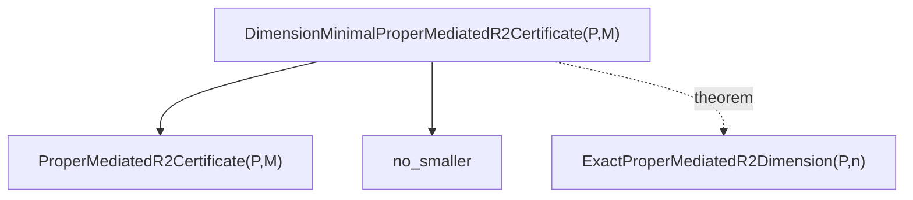
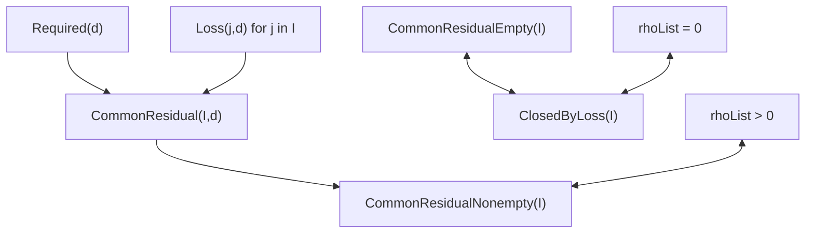
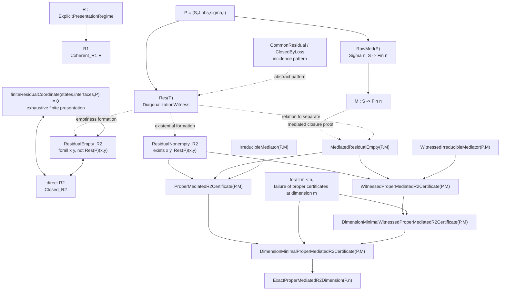

# Categorical Diagrams for R2

Status: diagrammatic note.

This file gives an informal categorical reading of the standalone module:

```text
RegimesSelfContained.lean
```

It is not yet a categorical formalization in Lean. Its purpose is to fix the
objects, fibers, projections, and invariants already present in the standalone
R1/R2 file, without adding arrows that do not correspond to Lean types.

## 1. Two Levels of Presentation

The Lean file separates two objects.

R1 depends on an abstract regime:

```text
R : ExplicitPresentationRegime
R1(R) := Coherent_R1 R
```

R2 depends on a presentation of interfaces:

```text
P = (S, J, obs, sigma, I)
```

where:

```text
S      : type of states
J      : type of interface indices
obs    : J -> S -> V
sigma  : S -> Y
I      : subfamily of interfaces
```

Corrected main diagram:

```mermaid
flowchart TD
  R["R : ExplicitPresentationRegime"]
  P["R2 presentation P<br/>(S, J, obs, sigma, I)"]

  R1["Coherent_R1 R"]

  Res["Res(P)<br/>Residual_R2 = DiagonalizationWitness"]
  ResNonEmpty["ResidualNonempty_R2(P)<br/>exists x y, Res(P)(x,y)"]
  ResEmpty["ResidualEmpty_R2(P)<br/>forall x y, not Res(P)(x,y)"]
  Closed["Closed_R2(P)<br/>direct closure"]

  RhoZero["finiteResidualCoordinate(states,interfaces,P) = 0<br/>under exhaustive finite presentation"]

  MedFiber["Med(P)<br/>Sigma n, S -> Fin n"]
  M["M : S -> Fin n"]
  Sep["MediatedResidualEmpty(P,M)<br/>M separates Res(P)"]
  Irred["IrreducibleMediator(P,M)"]
  Proper["ProperMediatedR2Certificate(P,M)"]
  NoSmall["forall m < n,<br/>failure of proper certificates at dimension m"]
  Min["DimensionMinimalProperMediatedR2Certificate(P,M)"]
  Exact["ExactProperMediatedR2Dimension(P,n)"]

  R --> R1

  P --> Res
  Res -. "existential formation" .-> ResNonEmpty
  Res -. "emptiness formation" .-> ResEmpty
  ResEmpty <--> Closed
  RhoZero <--> ResEmpty
  RhoZero <--> Closed

  P --> MedFiber
  MedFiber --> M
  M -. "dependent predicate + proof" .-> Sep
  Res -. "relation to separate" .-> Sep

  ResNonEmpty --> Proper
  Sep --> Proper
  Irred --> Proper

  Proper --> Min
  NoSmall --> Min
  Min --> Exact
```



Exact reading:

```text
R1(R)
```

certifies only the internal coherence of the explicit regime `R`.

```text
Closed_R2(P)
```

certifies the absence of diagonal witnesses in the interface presentation `P`.

```text
ProperMediatedR2Certificate(P,M)
```

certifies that the initial residual is inhabited, that `M` closes that
residual, and that `M` carries interface irreducibility.

```text
DimensionMinimalProperMediatedR2Certificate(P,M)
```

adds the failure of every proper certificate in every strictly smaller
dimension.

The arrows from `Res(P)` to `ResidualNonempty_R2(P)` and
`ResidualEmpty_R2(P)` are predicate formations:

```text
ResidualNonempty_R2(P) := exists x y, Res(P)(x,y)
ResidualEmpty_R2(P)    := forall x y, not Res(P)(x,y)
```

## 2. Diagonal Residual

For a fixed R2 presentation:

```text
P = (S, J, obs, sigma, I)
```

the diagonal residual is:

```text
Res(P) =
{ (x,y) in S x S |
  sigma x != sigma y
  and JointSame obs I x y }
```

This is exactly:

```lean
DiagonalizationWitness obs sigma I x y
```

and:

```lean
Residual_R2 obs sigma I x y
```

is an alias for this notion in the standalone file.

## 3. Direct R2 Closure



The arrow:

```text
Residual_R2 -> ResidualEmpty_R2
```

is a predicate-formation arrow, not an implication from a witness. The Lean
form is:

```lean
ResidualEmpty_R2 obs sigma I :=
  forall x y, not Residual_R2 obs sigma I x y
```

The file formalizes:

```lean
closed_R2_iff_residualEmpty
closed_R2_iff_no_diagonalizationWitness
```

Therefore, under the decidability hypotheses used by the file:

```text
Closed_R2(P)
iff
ResidualEmpty_R2(P)
iff
no diagonal witness remains.
```

## 4. Finite Coordinate

The finite coordinate does not give a raw arrow:

```text
finiteResidualCoordinate(P) -/-> ResidualEmpty_R2(P)
```

It gives an equivalence under an exhaustive finite presentation:

```text
finiteResidualCoordinate(states, interfaces, P) = 0
iff
ResidualEmpty_R2(P)
iff
Closed_R2(P)
```

The corresponding Lean hypotheses are:

```lean
[DecidableEq V]
[DecidableEq Y]
hPresentation :
  ExhaustiveFiniteResidualPresentation states interfaces I
```

The named bridges are:

```lean
finiteResidualCoordinate_zero_iff_residualEmpty
finiteResidualCoordinate_zero_iff_closed_R2
```

## 5. Main Categorical Scheme



Important point: a raw mediator

```lean
M : S -> Fin n
```

does not separate anything by itself. Separation is carried by the proof:

```lean
MediatedResidualEmpty obs sigma I M
```

This is why the separation arrow starts from `SepMed`, not from `RawMed`.

## 6. Fiber Above a Presentation

For a fixed presentation `P`, the raw mediator fiber is:

```text
RawMed(P) := Sigma n, S -> Fin n
```

The separating fiber adds the proof:

```text
SepMed(P) :=
Sigma n, Sigma M : S -> Fin n,
  MediatedResidualEmpty obs sigma I M
```

Diagram:



The central lemma is:

```lean
mediatedResidualEmpty_iff_mediator_separates_witnesses
```

It identifies:

```text
MediatedResidualEmpty(P,M)
```

with:

```text
forall x y,
  DiagonalizationWitness obs sigma I x y -> M x != M y.
```

## 7. Mediated and Proper Certificates



`MediatedR2Certificate` carries:

```text
MediatedResidualEmpty
IrreducibleMediator
```

`ProperMediatedR2Certificate` carries:

```text
ResidualNonempty_R2
MediatedResidualEmpty
IrreducibleMediator
```

Thus:

```text
ProperMediatedR2Certificate(P,M)
=>
MediatedR2Certificate(P,M)
```

by:

```lean
properMediatedR2Certificate.toMediatedR2Certificate
```

The converse direction requires the additional information:

```text
ResidualNonempty_R2(P).
```

## 8. Irreducibility



The central definition is:

```lean
IrreducibleMediator obs I M
```

which means:

```text
for every proper subfamily K of I,
M does not descend to K.
```

The witnessed version gives explicit states for every proper subfamily:

```text
JointSame obs K x y
and M x != M y.
```

It induces ordinary irreducibility by:

```lean
witnessedIrreducibleMediator_irreducibleMediator
```

For fixed `K`, `MediatorNonDescentWitness obs K M` directly provides the
corresponding obstruction to descent. The named global theorem in the file
passes through:

```text
WitnessedIrreducibleMediator
-> IrreducibleMediator
-> non-descent for each proper K.
```

## 9. Dimensional Minimality

Reading as an assembly of fields:



Reading as projections from the pointed structure:



The structure:

```lean
ExactProperMediatedR2Dimension obs sigma I n
```

carries:

```text
exists_at :
  ExistsProperMediatedR2CertificateAtDim obs sigma I n

no_smaller :
  forall m, m < n ->
    not ExistsProperMediatedR2CertificateAtDim obs sigma I m
```

The pointed version:

```lean
DimensionMinimalProperMediatedR2Certificate obs sigma I M
```

fixes a concrete mediator:

```lean
M : S -> Fin n
```

and obtains the exact dimension by:

```lean
exactProperMediatedR2Dimension_of_dimensionMinimalProperCertificate
```

The theorem:

```lean
endToEnd_staticProperMediatedR2Certificate
```

extracts the chain:

```text
ResidualNonempty_R2
MediatedResidualEmpty
IrreducibleMediator
forall m < n, no proper certificate at dimension m.
```

The witnessed variant:

```lean
endToEnd_staticWitnessedProperMediatedR2Certificate
```

replaces ordinary irreducibility with irreducibility carrying explicit
non-descent witnesses.

## 10. Incidence

The abstract incidence pattern is:

```text
Required(d)
Loss(j,d)
CommonResidual(I,d) := Required(d) and forall j in I, Loss(j,d)
ClosedByLoss(I) := no CommonResidual(I,d)
```

Diagram:



The equivalences with `rhoList` hold under the finite presentations of the
file:

```lean
ExhaustiveDistinctionPresentation distinctions
BooleanLossPresentation Required Loss I required loss interfaces
```

The Lean bridges are:

```lean
rhoList_zero_iff_closedByLoss
rhoList_pos_iff_commonResidualNonempty
```

Thus, under these hypotheses:

```text
rhoList = 0
iff closure by losses
iff empty common residual
```

and:

```text
rhoList > 0
iff existence of a common residual witness.
```

## 11. Final Large Diagram



## 12. Compact Categorical Formula

```text
MinCert -- forget --> PropCert -- pi --> Pres_R2 -- Res --> DiagRel
   |
   `-- dim --> Nat
```

The characteristic coordinate is a meta-mathematical notation:

```text
chi_R2(P) =
minimal dimension of a finite proper irreducible mediator
separating the diagonal residual of P.
```

Formal expansion:

```text
chi_R2(P) = n
```

means:

```lean
ExactProperMediatedR2Dimension obs sigma I n
```

that is:

```text
there exists M : S -> Fin n
such that ProperMediatedR2Certificate obs sigma I M,

and for every m < n,
there is no proper certificate at dimension m.
```

The stronger pointed version is:

```lean
DimensionMinimalProperMediatedR2Certificate obs sigma I M
```

It provides:

```text
ResidualNonempty_R2 obs sigma I
MediatedResidualEmpty obs sigma I M
IrreducibleMediator obs I M
forall m < n,
  not ExistsProperMediatedR2CertificateAtDim obs sigma I m
```

via:

```lean
endToEnd_staticProperMediatedR2Certificate
```

## 13. Final Reading

```text
R1:
  internal coherence of an explicit regime R.

Direct R2:
  absence of a diagonal witness in an interface presentation P.

Proper mediated R2:
  presence of an initial diagonal witness,
  separation of all witnesses by a finite mediator,
  irreducibility of the mediator.

Dimension-minimal R2:
  no proper certificate of strictly smaller dimension
  realizes this closure.
```

The invariant point is:

```text
extensional agreement is not local informational faithfulness.
```

The standalone file does not merely certify an output. It isolates diagonal
witnesses, then certifies their direct closure or their separation by a finite
irreducible mediator.
